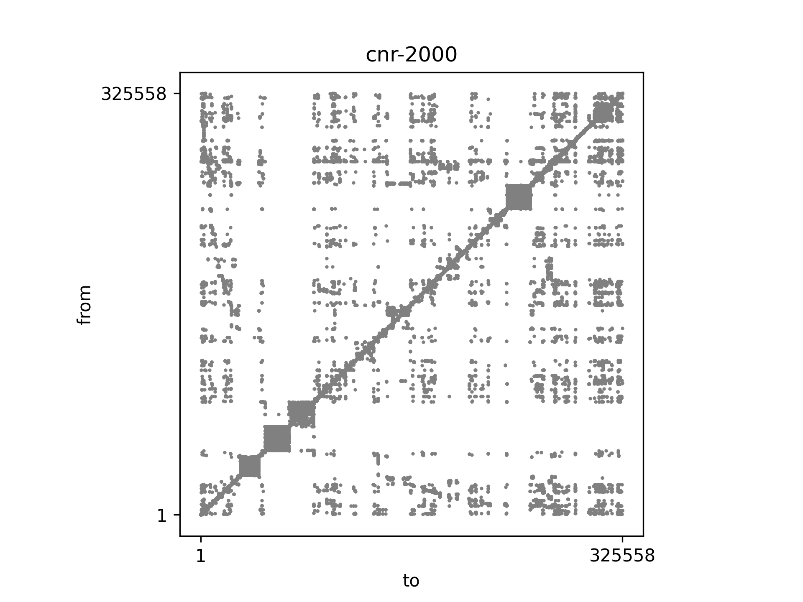
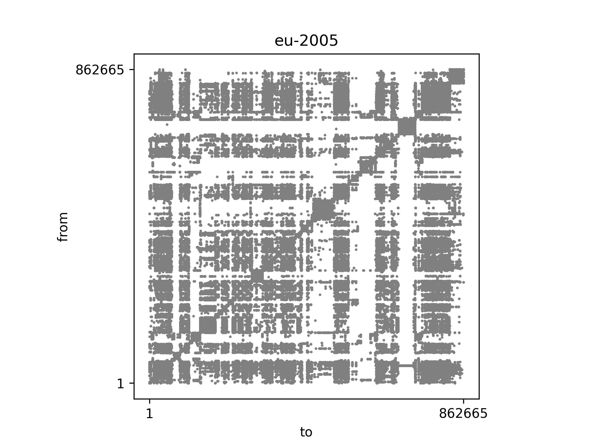
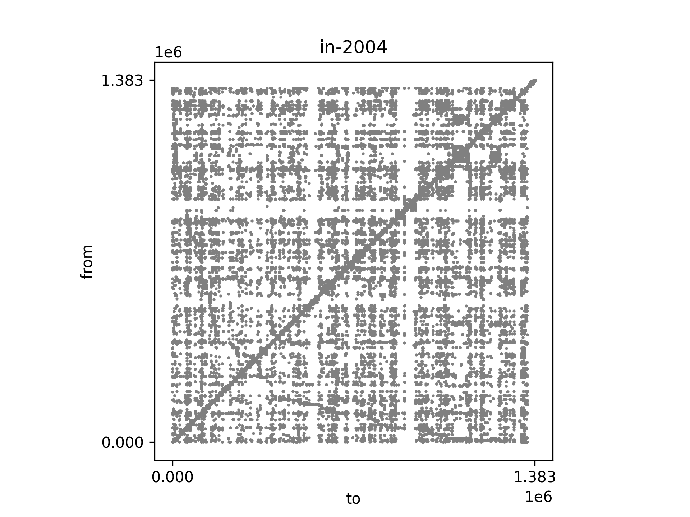
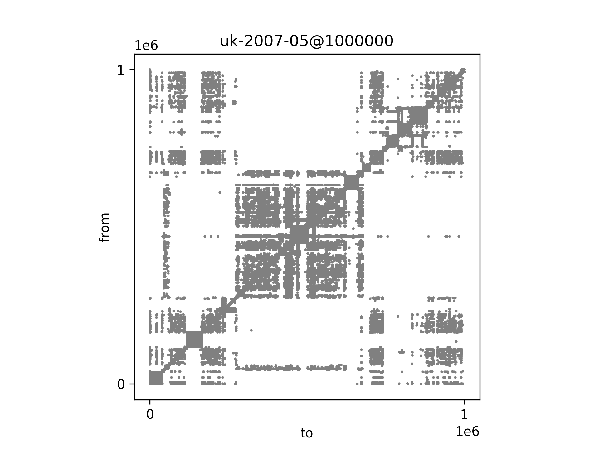

# WGC
A benchmark pipeline of web graph compression algorithms.

All of these experiments are conducted under Linux (@Deepin 15.11).

# Requirements

- JDK 9.0
- g++ 7.0+
- Python 3
- WebGraph datasets

# Datasets

Run `make download` or `python -m utilities.download_dataset` under `./` to download the datasets. All small crawls will be downloaded by defaults.

Note that options could be modified in `./utilities/download_dataset.py`, to download other large crawls.

## Conversion

To run experiments of LZ78 and Re-Pair and the visualisation script, you need to convert the datasets file from BVGraph to plain binary format first.

Compile the java code by running `make convert`, and the outputs will also be `./webgraph_datasets`.

The `./utilities/Transform.py` is modified by me, and the original conversion code is obtained from https://webgraphs.recoded.cl/.

# Visualisation

This pipeline also contains a script for visualisation the adjacency matrix of web graphs.

Run `python -m visualisation.AM` under `./`.

## Results

# Experiments

You could comment out or uncomment related code in `./makefile` to run experiments on any datasets.

## LZ78

This part of code is obtained from https://webgraphs.recoded.cl/.

Run `make` under `./compression/lzgraph-1.0`

Then run `make test_lz` under `./`.

The `use.cpp` is modified by me.

## Re-Pair

This part of code is obtained from https://webgraphs.recoded.cl/.

Run `make` under `./compression/rpgraph-1.0`.

Then `make test_rp` under `./`.

The `use.cpp` is modified by me.

## WebGraph

The jar file of WebGraph is obtained from http://webgraph.di.unimi.it/.

Run `make test_webgraph` under `./`.

The output will be also in `./experiments`.

## k2-tree

The k2-tree is implemented in `./compression/k2tree`, but no experiment is conducted.

